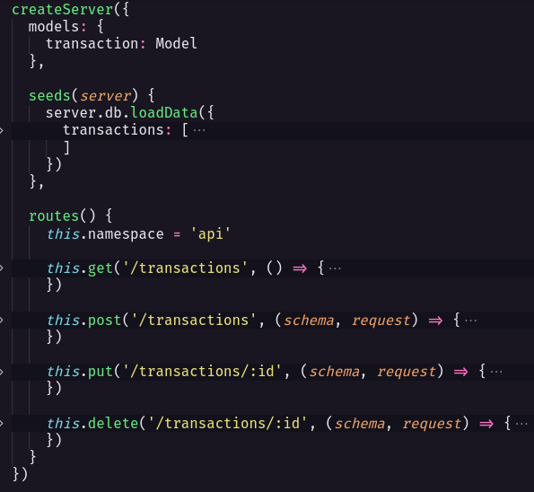

<p align="center">
  
</p>

<h1 align="center">dt money</h1>
Projeto feito para estudo do ReactJS e tecnologias do seu ecossistema como Styled Components, MirageJS, Context API, hooks e Axios.

## 📋 O projeto

O dt money é uma aplicação de controle financeiro que permite cadastrar transações e exibir um resumo das entradas, saídas e total disponível.

## 🚀 Next Level

<p align="center">
  
  <blockquote>Projeto responsivo</blockquote>
</p>

<br />
 
<p align="center">
  
  
  <blockquote>Funcionalidade de editar/deletar uma transação</blockquote>

Criando essa funcionalidade, pude praticar mais o uso de contextos no React, criando um contexto e um hook para gerenciar os modais. Além de precisar consultar a documentação do MirageJS ao precisar criar rotas para os métodos PUT e DELETE para poder editar e excluir uma transação.

</p>

## ⚡ Hightlights

### 🏝 MirageJS

O MirageJS é uma ferramenta que permite criar uma fake API mas também conta com várias outras funcionalidades como um database que permite várias operações. Foi algo novo e muito bacana de se ver!

Uma fake API agiliza o desenvolvimento, possibilitando criar grande parte do Front end (se não toda) sem o Back end estar pronto



> Código de exemplo

### Método `.reduce()` 🤯
Uma nova perspectiva sobre o método foi me dada, deixando de lado a ideia de que o reduce só serve para somar valores de um array numérico.

```typescript
const summary = transactions.reduce((accumulator, transaction) => {
    type SummaryReduceOperations = {
      [operationName: string]: () => void
    }

    const { type, amount } = transaction

    const operation: SummaryReduceOperations = {
      deposit: () => {
        accumulator.deposits += amount
        accumulator.total += amount
      },
      withdraw: () => {
        accumulator.withdraws -= amount
        accumulator.total -= amount
      }
    }

    operation[type]()

    return accumulator
  },
  { deposits: 0, withdraws: 0, total: 0 }
)
```